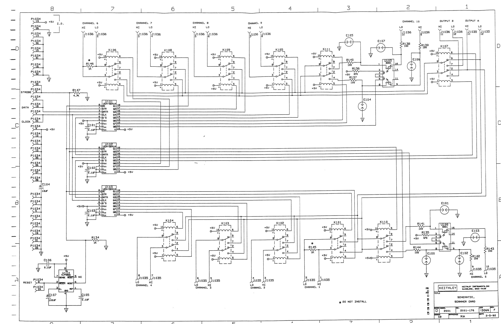
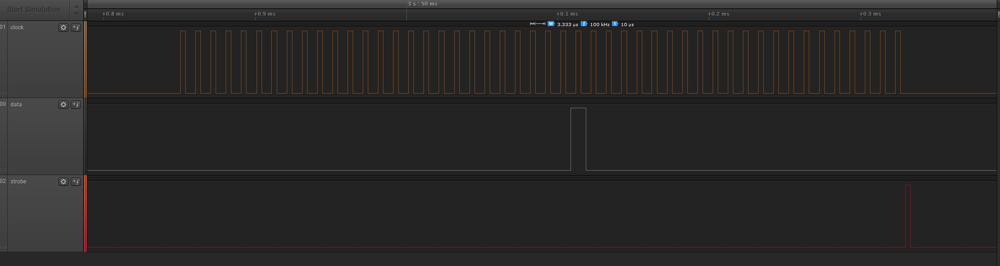
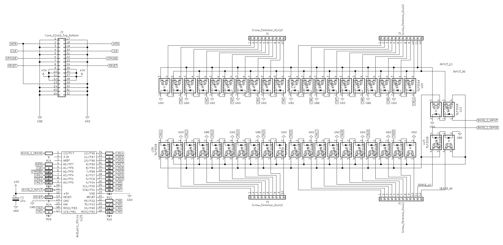
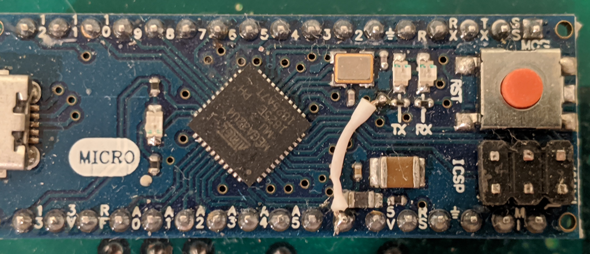

# CozScan2020

This is a do-it-yourself 20-channel solid-state scanner card compatible with Keithley 2000-SCAN-20 and thus should work with Keithley 2000, 2001, 2002, 2010 and DMM6500 bench multimeters. **Currently this design is tested only on DMM6500.**

|**== Warning ==**|
|-|
| **If you decide to build and/or use this card do it at your own risk. I do not guarantee that this design works properly and I can't guarantee that using this won't result any damages to the equipment or won't cause injury. Electrical or thermal limits of this design are unknown/unspecified. So please make sure that you understand the design before attempting to build and/or use it.**|

## History behind the project
I've always had a multimeter since highschool, where I studied electronics. But all of them were handheld devices. So recently I decided to get a bench multimeter and Keithley DMM6500 seemed like a perfect choice for my needs. I liked the scanner card support which makes the unit work as a small data acqusition system. I bought a used 2000-SCAN card from eBay and it worked perfectly, I was able to record multiple quantities over long time spans and analyse their dependencies (such as tempco measurement ). But there was one problem: the original SCAN-2000 card has mechanical relays and they are loud therefore logging multiple channels overnight in my office, which is near our bedroom, was an annoying dripping-tap simulator. So I decided to build myself a silent solid-state version.

The original Keithley SCAN-2000 card has a very basic design: few serial-to-parallel shift registers and bunch of bi-stable (latching) mechanical relays. The control signal from the DMM has 3 lines: clock, data and strobe. The card's manual has the full schematic; by looking at the schematic you can determine which bit does what. After realizing that the 20-channel scan-2020 card uses the same interface and the same basic circuit design, I decided to implement a 20 channel card, the more the merrier. The DMM determines the installed card type using the ID pins (13 and 29) on the connector. 

## Reverse Engineering the Communication

The schematic shows all the connections and logic but doesn't tell much about the timings and how the DMM drives the relays. For that reason I just sniffed the clock, data and strobe lines both in scan-2000 and scan-2020 mode using both my oscillascope and a cheap logic analyser. You can find the [logic analyser logs](Documents/LogicAnalyserLogs/) in the Documents folder. You can open the files with [Saleae Logic software](https://www.saleae.com/downloads/)

Here are the key timing figures:

* Clock: 100kHz, %33 duty
* Data: 10us, centered around clock pulse
* Relay coil current duration: 4ms
* Strobe Pulse: 3.333ms
* Channel off to channel on: ~1.7ms

## Circuit Design

Initially I was planning to replicate the same circuit, using the same or similar components. One problem with that approach was that unlike the mechanical latching relays, the solid state relays are not latching thus I had add latches to the circuit so that the turned on relay stays on even after the DMM sets the coil off. This quickly increased the number of compoments required for the board. 

So instead of following the same design with primitive logic elements, I decided to switch to a microcontroller + software solution. I needed a cheap microcontroller with at least 25 IO pins (20 outputs for the channels, 2 outputs for directing the upper channels either to input or to sense and 3 input pins for DMM communication). The most convenient solution turned out to be using a cheap arduino micro compatible board with ATmega32U4 MCU. One minor problem with that board was that only 24 of the 26 IO pins of the ATmega32U4 were exposed on the board pinout and that was unfortunately 1 short of what I needed. But after checking the Arduino Micro schematic I saw that it's easy to pull a wire from the TX led to one of the unused pins, exposing PD5 signal and thus increasing the IO pin count to needed 25.

One gothca you need to be careful while choosing a MCU board is that some boards with certain bootloader firmware (Such as Arduino Uno) will blink the LED while booting. Make sure that the board+firmware you have doesn't have this behavior.

As SSRs I picked Toshiba TLP3558A as it seemed to be at the sweet spot of on-resistance, price and leakage current. It might not be the best choice, feel free to modify that to your taste.

## PCB Design
This is a "Do-It-Yourself as much as you can" project, thus I wanted to make my own PCB. Since I can't do through-hole plating I designed the layout such that the pins of the components are used as the vias and for this reason I preferred through-hole components. A more tidy and even compact layout with SMD components should be possible if the PCB will be manufactured professionally. First I tried to use Eagle CAD, which I was already familiar with, but the free version is not supporting boards this big. Internets(tm) seems to agree on the KiCAD as one of the best options, thus I learned how to use KiCAD and used it for this project.

You can find the KiCAD project files in the [KiCAD folder](KiCad/). Since this is my very first KiCAD design, I'm sure that there are some mistakes/not-so-correct things I've done. Let me know if you spot any.

## Software

My first attemp was an interrupt-driven software but it was behaving erratically. After a short debugging session I found the source of the problem: the MCU was not fast enough and was missing the clocks. I tried to optimize the code as much as I can with some bit-magic etc but it was still missing the clocks. So I decided to switch to active polling mode and disable the inturrupts completely, making the system more suitable for a realtime application. Polling the clock edges in an active loop indeed worked properly and it was fast enough that I was able to squeeze in some sanity checking routine to the code; making sure that we collected correct number of bits before the strobe, only one channel is connected to the input or sense terminals etc.

The Arduino studio source is located in the [Arduino](Arduino/) folder.

## Bill of Materials
- DMM Connector: 1x [Molex 85050](https://www.digikey.com/product-detail/en/molex/0850500000/WM20488-ND/2790645)
- Solid State Relay: 24x [Toshiba TLP3558A](https://www.digikey.com/product-detail/en/toshiba-semiconductor-and-storage/TLP3558A-F/TLP3558A-F-ND/8539925)
- Cable Terminal Blocks: 
  - 12 Pos: 2x [Phoenix Contact 1869318](https://www.digikey.com/product-detail/en/phoenix-contact/1869318/277-6361-ND/349230)
  - 10 Pos: 2x [Phoenix Contact 1869295](https://www.digikey.com/product-detail/en/phoenix-contact/1869295/277-6063-ND/349229)
- Controller: 1x [Arduino Micro](https://store.arduino.cc/usa/arduino-micro) (or [a clone](https://www.amazon.com/dp/B00J1X5B7Y))
- Resistors
  - 22x 120 Ohm 1/4W
  - 3x 1 kOhm 1/4W
- Capacitor: 1uF 16V
- PCB: 205mm x 70mm x 1.5mm, dual-sided
